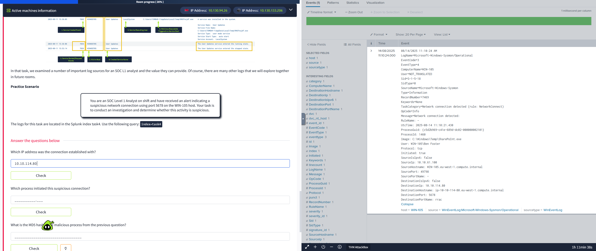
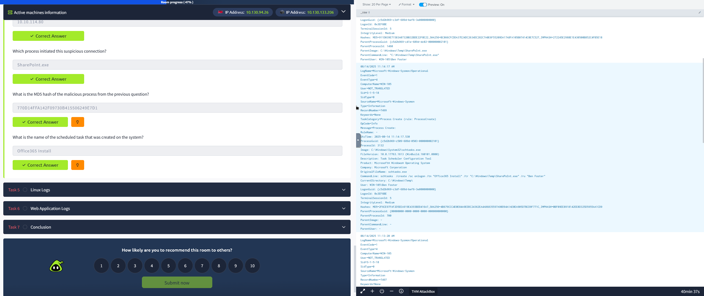
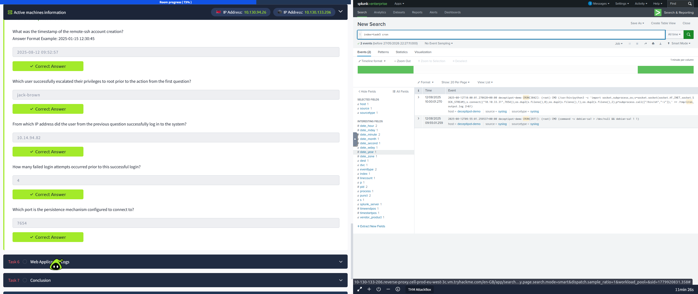
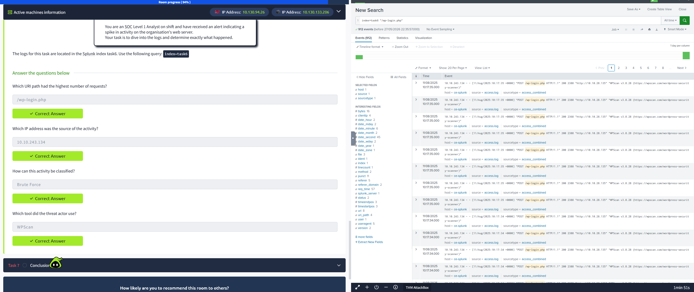

# 🛡️ SIEM / Splunk log-analysis practice (lab & TryHackMe scenarios)

[](https://www.splunk.com/)
[](https://learn.microsoft.com/en-us/sysinternals/downloads/sysmon)
[](https://linux.org)
[](https://www.nginx.com/)

This project showcases hands-on log analysis in a lab environment using Splunk. The focus is purely on log analysis: parsing and correlating logs from Windows (Sysmon & Security), Linux (syslog/auth.log), and Nginx web servers to reconstruct attack paths, extract indicators of compromise (IOCs), and solve security incidents based on TryHackMe scenarios.

---

## TASK 4: Windows Endpoint Forensics (Suspicious Connection & Persistence)

* **Objective:**
  Investigate a high-severity alert indicating workstation `WIN-105` communicating over non-standard port `5678`. Locate the originating process, identify persistence mechanisms, and extract malware indicators.

* **Process:**
  1. Filtered Sysmon network connection events (`EventCode=3`) for host `WIN-105` and port `5678`:
     ```splunk
     index=task4 ComputerName="WIN-105" DestinationPort=5678 EventCode=3
     | table _time, ComputerName, SourceIp, DestinationIp, Image, ProcessId, User
     ```
     *Found:* The process `C:\SharePoint.exe` (PID `1469`) under user `Ben Foster` connected to external IP `10.10.114.80`.

  2. Analyzed process creation (`EventCode=1`) for PID `1469` to retrieve the parent process and cryptographic file hash:
     ```splunk
     index=task4 ComputerName="WIN-105" EventCode=1 ProcessId=1469
     | table _time, Image, ParentImage, CommandLine, Hashes
     ```
     *Found:* `C:\SharePoint.exe` was spawned by `explorer.exe` (user execution). MD5 hash: `770D14FFA142F09730B415506249E7D1`.

  3. Hunted for persistence by querying scheduled task creation (`EventCode=4698` or `schtasks.exe` executions):
     ```splunk
     index=task4 ComputerName="WIN-105" (EventCode=4698 OR "schtasks.exe")
     | table _time, TaskName, Command, Message
     ```
     *Found:* A suspicious scheduled task named `Office365 Install` was created to run the malicious payload.

* **Result:**
  * Identified C2 Server: `10.10.114.80:5678`
  * Identified Malicious Binary: `SharePoint.exe` (MD5: `770D14FFA142F09730B415506249E7D1`)
  * Located Persistence: `Office365 Install` scheduled task

#### Windows Forensic Evidence



---

## TASK 5: Linux OS Forensics (SSH Privilege Escalation & Backdoor)

* **Objective:**
  Investigate suspicious account activity on an Ubuntu Server (`deceptipot-demo`). Audit authentication logs to trace the entry vector, privilege escalation method, new backdoor accounts, and persistence scripts.

* **Process:**
  1. Searched Linux security logs (`syslog` / `linux_secure`) for user additions to find the backdoor account and its timestamp:
     ```splunk
     index=task5 sourcetype=linux_secure "useradd" OR "new user"
     ```
     *Found:* Backdoor account `remote-ssh` was created at `2025-08-12 09:52:57`.

  2. Audited `sudo` commands executed before user creation to find how root privilege was acquired:
     ```splunk
     index=task5 sourcetype=linux_secure process=sudo
     | sort _time
     ```
     *Found:* Compromised user `jack-brown` ran `sudo /bin/sh` to drop into a root shell.

  3. Traced initial access by querying SSH logins for `jack-brown` to find the attacker's IP and check for brute-force patterns:
     ```splunk
     index=task5 sourcetype=linux_secure "Accepted password for jack-brown"
     ```
     *Found:* SSH connection accepted from IP `10.14.94.82`.
     Counted failed attempts preceding the login:
     ```splunk
     index=task5 sourcetype=linux_secure "Failed password for jack-brown" | stats count
     ```
     *Found:* Exactly `4` failed login attempts immediately prior, indicating a brute-force dictionary attack.

  4. Looked for active persistence mechanisms in `/tmp/` and cron logs:
     ```splunk
     index=task5 sourcetype=syslog ("/tmp/*" OR "cron" OR "perl")
     ```
     *Found:* A cron job executing `/tmp/pnr5433sw.sh` every 5 minutes, initiating a Perl-based reverse shell targeting port `7654`.

* **Result:**
  * Threat Actor Source IP: `10.14.94.82` (compromised `jack-brown` via 4 failed/1 successful login brute-force attempts)
  * Privilege Escalation Vector: `sudo /bin/sh`
  * Backdoor Created: User `remote-ssh` at `09:52:57`
  * Persistence: Cron job running `/tmp/pnr5433sw.sh` with a Perl reverse shell on port `7654`

#### Linux Forensic Evidence


---

## TASK 6: Web Server Auditing (Application Reconnaissance & WPScan)

* **Objective:**
  Analyze Nginx web access logs on the corporate web server (`ce-splunk`) to investigate a sudden traffic spike. Isolate the source IP, find targeted endpoints, and identify the scanning tool used.

* **Process:**
  1. Identified the top target URI to see where the traffic spike was directed:
     ```splunk
     index=task6 sourcetype=access_log
     | stats count by uri_path
     | sort - count
     | head 5
     ```
     *Found:* Over 95% of requests targeted the WordPress login portal `/wp-login.php`.

  2. Isolated the unique source IP targeting `/wp-login.php`:
     ```splunk
     index=task6 sourcetype=access_log uri_path="/wp-login.php"
     | stats count by clientip
     | sort - count
     ```
     *Found:* Attacker IP is `10.10.243.134`.

  3. Analyzed HTTP request methods and browser User-Agent strings to determine the attack type and tools:
     ```splunk
     index=task6 clientip="10.10.243.134" uri_path="/wp-login.php"
     | table _time, method, status, useragent
     | dedup useragent
     ```
     *Found:* High frequency of HTTP `POST` requests (credential stuffing/brute force) using the User-Agent `WPScan v3.8.20 (https://wpscan.com/wordpress-security-scanner)`.

* **Result:**
  * Attacker IP: `10.10.243.134`
  * Target: `/wp-login.php` (brute-force credential guessing)
  * Tooling Used: `WPScan`

#### Web Application Forensic Evidence


---

## P.S. (Post Scriptum)
If needed, all of these threat activities can be mapped to frameworks like **MITRE ATT&CK** (e.g., T1110 for Brute Force, T1053 for Scheduled Tasks, T1548 for Privilege Escalation) and standard remediation steps (such as disabling password auth for SSH, rate-limiting `/wp-login.php` on Nginx, or setting up AppLocker policies in Windows). However, the primary goal here is to demonstrate direct, practical proficiency in working with SIEM Splunk, writing search queries (SPL), and analyzing raw security logs across OS and application layers to solve security incidents.

---

## Author

**Yauheni Skrypnikau** — Career-changer building blue-team / SOC skills  
*   **LinkedIn:** [linkedin.com/in/skrypnikau](https://www.linkedin.com/in/skrypnikau)
*   **GitHub:** [github.com/skrypnikau](https://github.com/skrypnikau)
